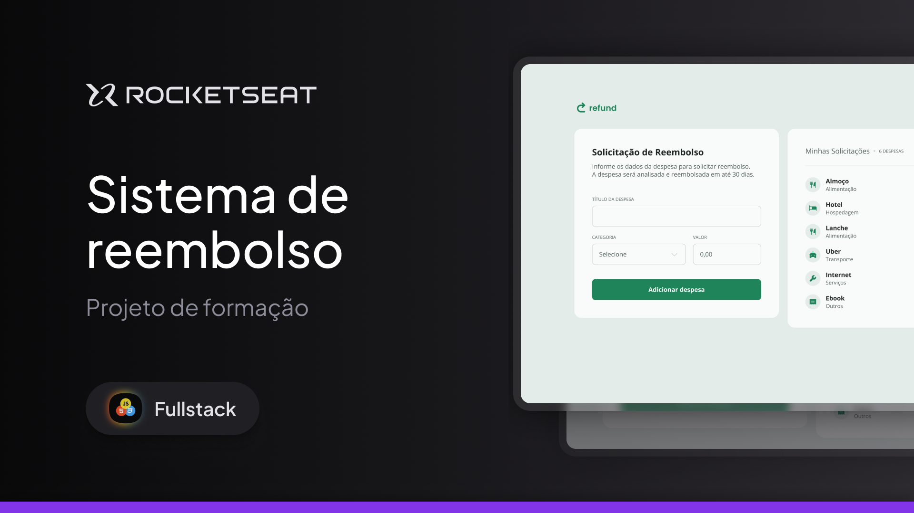

Projeto – Sistema de Reembolso Corporativo

Protótipo de um sistema de reembolso desenvolvido para praticar criação de interfaces interativas, organização de layout e manipulação de dados com JavaScript, voltado para controle de despesas corporativas e solicitações de reembolso.

📸 Pré-visualização  

💡 Imagem ilustrativa do sistema exibindo formulário de solicitação de reembolso e lista de despesas adicionadas, com cálculo automático do valor total.

🛠 Tecnologias utilizadas  
HTML5  
CSS3  
JavaScript (ES6+)  
Manipulação do DOM  

🎞 Características do projeto  
Formulário para solicitação de reembolso  
Cadastro de despesas com categoria e valor  
Listagem dinâmica das despesas adicionadas  
Cálculo automático do total a ser reembolsado  
Interface moderna com layout clean e responsivo  
Feedback visual para ações do usuário  

▶️ Como visualizar o projeto  
Baixe ou clone este repositório  
git clone https://github.com/seu-usuario/nome-do-repositorio.git  
Abra o arquivo index.html no navegador  

📚 Aprendizados  
Manipulação do DOM com JavaScript  
Trabalho com formulários e validação de dados  
Atualização dinâmica de listas e valores  
Organização de layout e componentes de interface  
Boas práticas de estruturação em JavaScript  

🚀 Próximos passos  
Persistir dados com LocalStorage  
Implementar edição e exclusão de despesas  
Adicionar filtros por categoria  
Criar relatórios de gastos  
Preparar integração com backend  
